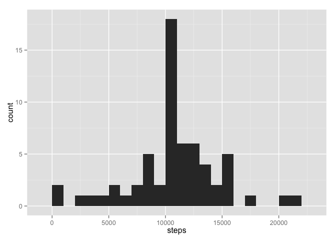
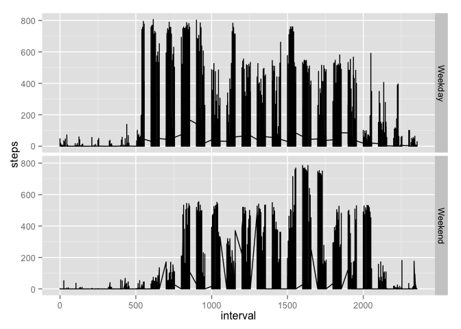

# Reproducible Research: Peer Assessment 1


## Loading and preprocessing the data
Unzip the activity.zip file and load the data. Convert the date column to actual dates.

```r
library(ggplot2)
unzip("activity.zip", overwrite = TRUE)
activityData <- read.csv("activity.csv")
```

## What is mean total number of steps taken per day?
First, aggregate the number of steps per day  

```r
totalSteps <- aggregate(steps ~ date, data = activityData, sum)
```

Make a histogram of the total number of steps taken each day  

```r
qplot(steps, data = totalSteps, binwidth = 1000)
```

 

Calculate and report the **mean** total number of steps taken per day  

```r
mean(totalSteps$steps)
```

```
## [1] 10766.19
```

Calculate and report the **median** total number of steps taken per day  

```r
median(totalSteps$steps)
```

```
## [1] 10765
```

## What is the average daily activity pattern?
Aggregate the data to calcuate the average daily activity

```r
stepsPerInterval <- aggregate(steps ~ interval, data = activityData, mean)
```

Make a time series plot (i.e. `type = "l"`) of the 5-minute interval (x-axis) and the average number of steps taken, averaged across all days (y-axis)

```r
ggplot(stepsPerInterval, aes(x=interval, y=steps)) + geom_line()
```

 

Which 5-minute interval, on average across all the days in the dataset, contains the maximum number of steps?

```r
stepsPerInterval$interval[which.max(stepsPerInterval$steps)]
```

```
## [1] 835
```

## Imputing missing values
Calculate and report the total number of missing values in the dataset (i.e. the total number of rows with `NA`s)

```r
sum(!complete.cases(activityData))
```

```
## [1] 2304
```

Devise a strategy for filling in all of the missing values in the dataset. The strategy does not need to be sophisticated. For example, you could use the mean/median for that day, or the mean for that 5-minute interval, etc.
```
Since only the steps data is missing, we can replace it with the mean steps for that interval that we calculated above
```

Create a new dataset that is equal to the original dataset but with the missing data filled in.

```r
completeData <- activityData
for (i in 1:nrow(completeData)) {
  if (is.na(completeData[i,1])) {
    completeData[i,1] <- stepsPerInterval$steps[stepsPerInterval$interval == completeData[i,3]]
  }
}
```

Make a histogram of the total number of steps taken each day. 

```r
totalStepsImputingValues <- aggregate(steps ~ date, data = completeData, sum)
qplot(steps, data = totalStepsImputingValues, binwidth = 1000)
```

 

Calculate and report the **mean** total number of steps taken per day.

```r
mean(totalStepsImputingValues$steps)
```

```
## [1] 10766.19
```

Calculate and report the **median** total number of steps taken per day.

```r
median(totalStepsImputingValues$steps)
```

```
## [1] 10766.19
```

Do these values differ from the estimates from the first part of the assignment? What is the impact of imputing missing data on the estimates of the total daily number of steps?
```
The mean looks the same, but the median has moved to the same value as the mean.
```

## Are there differences in activity patterns between weekdays and weekends?
Create a new factor variable in the dataset with two levels -- "weekday" and "weekend" indicating whether a given date is a weekday or weekend day.

```r
completeData <- transform(completeData, dayType = as.factor(ifelse(weekdays(as.Date(completeData$date)) %in% c("Saturday","Sunday"), "Weekend", "Weekday")))
```

Make a panel plot containing a time series plot (i.e. `type = "l"`) of the 5-minute interval (x-axis) and the average number of steps taken, averaged across all weekday days or weekend days (y-axis). The plot should look something like the following, which was created using **simulated data**:

```r
qplot(x = interval, y = steps, data = completeData, geom = "line", facets = dayType ~ .)
```

 

